# Enterprise Detection Engineering SOC Lab

[](https://github.com/sandeepmothukuri/Enterprise-Detection-Engineering-SOC-Lab/actions) [](https://cybertechnology.in) [](https://attack.mitre.org/)

> A hands-on, fully open-source Security Operations Center lab running 12 production-grade tools via Docker Compose. Built for SOC Level 2/3 analyst training, blue team skill development, and adversary emulation — all on a single machine.

**Author:** Sandeep Mothukuri  
**Stack:** 12 tools · 100% free · MITRE ATT&CK v14 · Docker Compose  
**Minimum:** 16 GB RAM · 50 GB disk · Linux / WSL2 / macOS

---

## Screenshots

### Command Center Portal
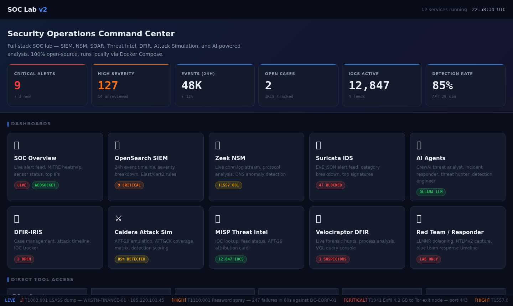

### SOC Overview — Live Alert Feed
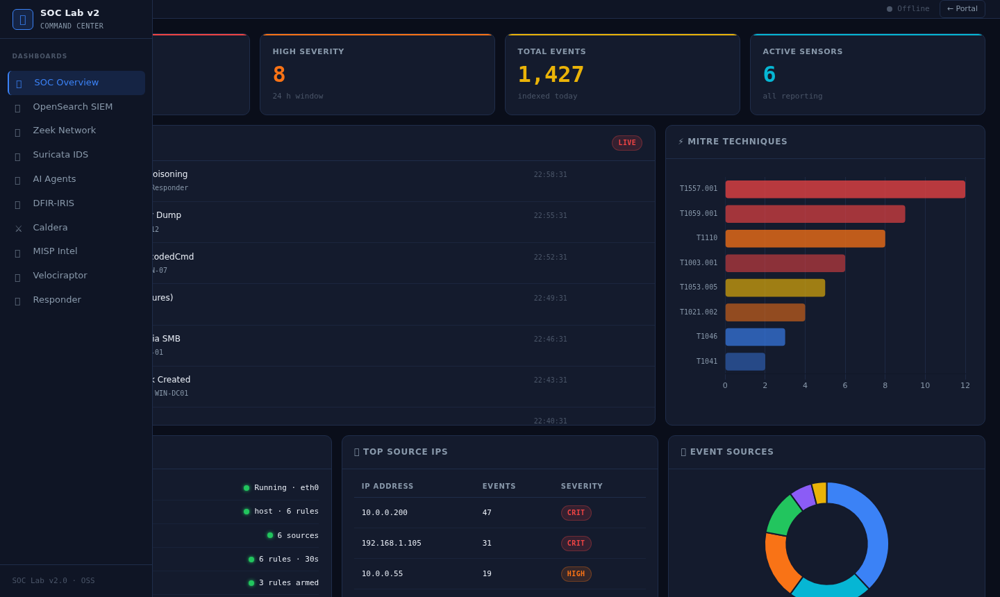

### OpenSearch SIEM — 24h Event Timeline
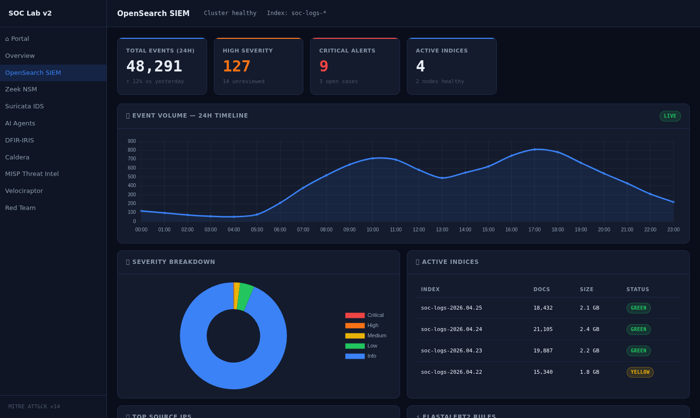

### Zeek NSM — Network Traffic Analysis
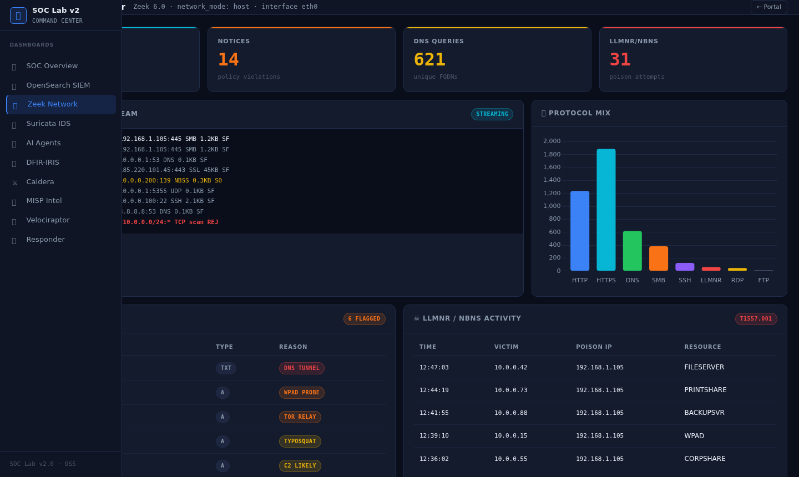

### Suricata IDS — EVE JSON Alert Feed
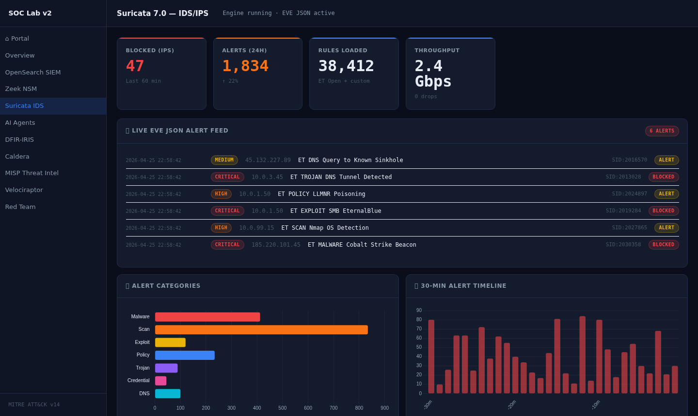

### AI Agents — CrewAI Threat Analysis
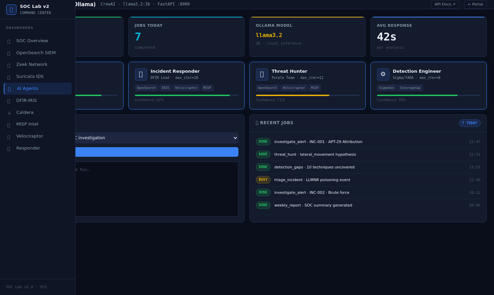

### DFIR-IRIS — Case Management & Attack Timeline
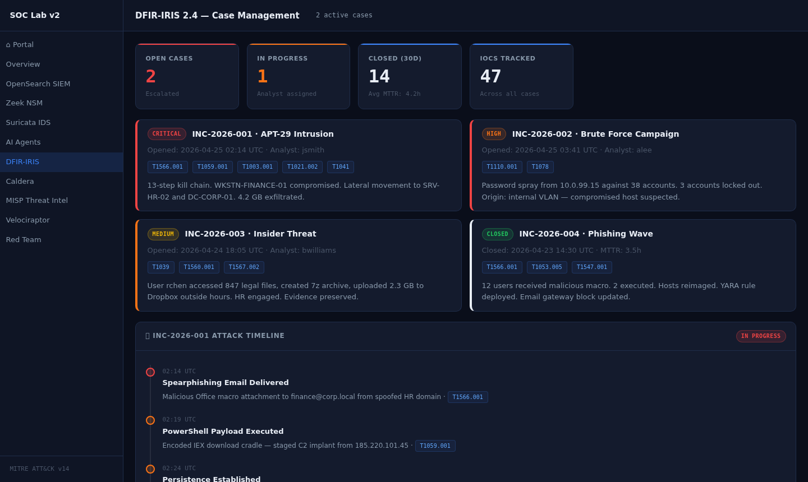

### MITRE Caldera — Adversary Emulation
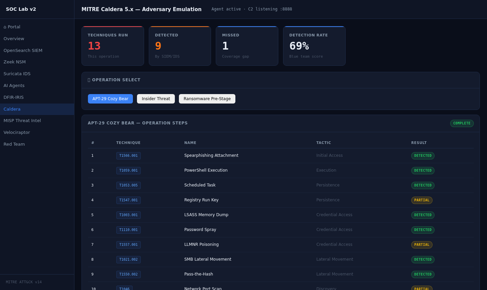

### MISP — Threat Intelligence Platform
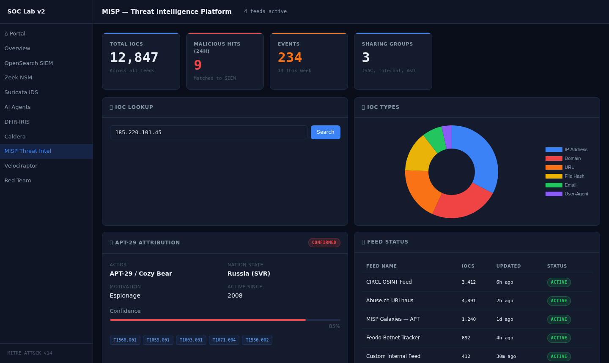

### Velociraptor — Live Forensics & DFIR
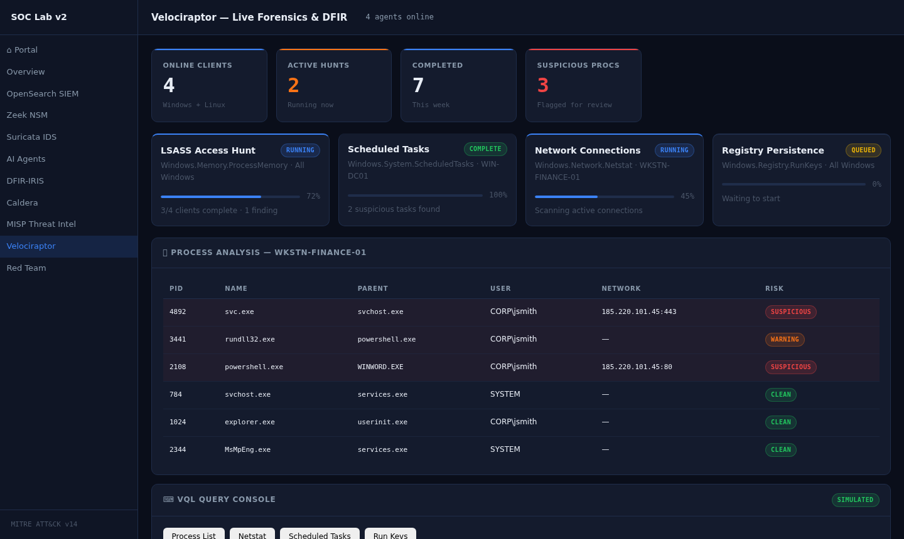

### Red Team — Responder + LLMNR Poisoning
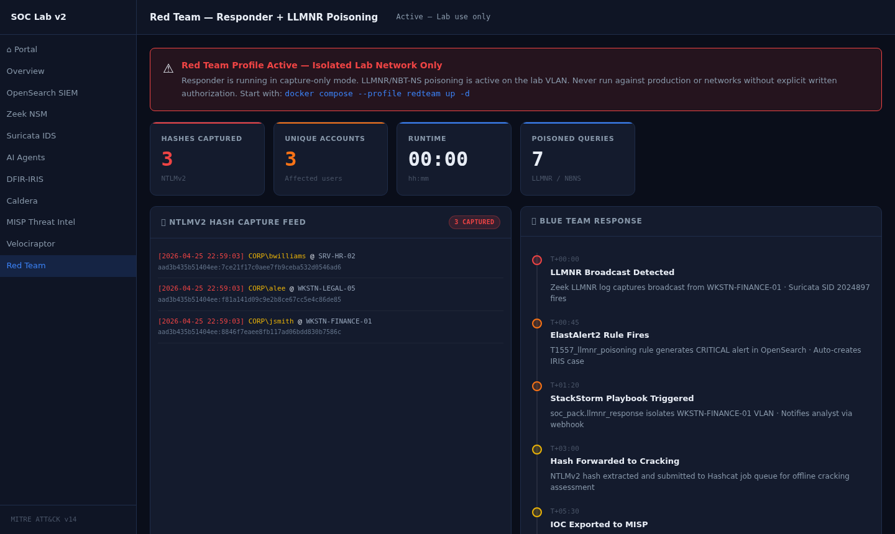

---

## Overview

The Advanced SOC Lab v2.0 is a complete, self-contained security operations environment designed for hands-on learning. Every component is open-source and orchestrated with Docker Compose, so you can spin up a full SOC stack in under 15 minutes.

### What You Get

| Layer | Tool | Purpose |
|---|---|---|
| **SIEM** | OpenSearch 2.13 + Dashboards | Log ingestion, search, visualization |
| **Log Pipeline** | Vector 0.38 | Unified log routing and transformation |
| **Detection** | ElastAlert2 | Rule-based alerting from OpenSearch |
| **Network NSM** | Zeek 6.0 + Suricata 7.0 | Packet-level network security monitoring |
| **SOAR** | StackStorm 3.8 | Automated response playbooks |
| **Case Mgmt** | DFIR-IRIS 2.4 | Incident tracking, timelines, IOCs |
| **Threat Intel** | MISP | IOC sharing, feeds, attribution |
| **DFIR** | Velociraptor | Live forensics, VQL hunting |
| **Attack Sim** | MITRE Caldera 5.x | Adversary emulation, ATT&CK mapping |
| **Red Team** | Responder | LLMNR/NBT-NS poisoning (lab profile) |
| **AI Analysis** | Ollama + CrewAI | LLM-powered SOC agents |

### Detection Rules (15 built-in)

| Rule | Technique | Severity |
|---|---|---|
| Brute Force / Password Spray | T1110.001 | High |
| LSASS Memory Dump | T1003.001 | Critical |
| PowerShell Encoded Command | T1059.001 | High |
| Lateral Movement via SMB | T1021.002 | Critical |
| LLMNR/NBT-NS Poisoning | T1557.001 | High |
| Scheduled Task Creation | T1053.005 | Medium |
| Registry Run Key Persistence | T1547.001 | Medium |
| DNS Tunneling C2 | T1071.004 | High |
| Pass-the-Hash | T1550.002 | Critical |
| Network Port Scan | T1046 | Medium |
| Data Exfiltration over C2 | T1041 | Critical |
| Defender Disabled | T1562.001 | Critical |
| Spearphishing Attachment | T1566.001 | High |
| Bulk File Collection | T1039 | Medium |
| After-Hours Account Login | T1078 | Medium |

### AI Agents

| Agent | Role | Capability |
|---|---|---|
| Threat Analyst | APT attribution, TTP mapping | Correlates IOCs with threat actors |
| Incident Responder | Triage and containment | Generates response playbooks |
| Threat Hunter | Proactive hunting | Builds VQL queries from hypotheses |
| Detection Engineer | Rule creation | Writes ElastAlert2 and Sigma rules |

---

## Architecture

```
Internet / Lab Network
        │
   ┌────▼─────────────────────────────────────────────┐
   │              Docker Compose Network               │
   │                                                   │
   │  ┌──────────┐  ┌──────────┐  ┌────────────────┐  │
   │  │  Zeek    │  │ Suricata │  │  Log Sources   │  │
   │  │ (NSM)    │  │ (IDS)    │  │  Sysmon/Win    │  │
   │  └────┬─────┘  └────┬─────┘  └───────┬────────┘  │
   │       └─────────────┴────────────────┘           │
   │                     │ Vector 0.38                 │
   │               ┌─────▼──────┐                      │
   │               │ OpenSearch │◄─── ElastAlert2      │
   │               │  (SIEM)    │                      │
   │               └─────┬──────┘                      │
   │                     │                             │
   │        ┌────────────┼────────────┐                │
   │        ▼            ▼            ▼                │
   │   StackStorm    DFIR-IRIS      MISP               │
   │   (SOAR)       (Cases)        (Threat Intel)      │
   │        │            │            │                │
   │        └────────────┴────────────┘                │
   │                     │                             │
   │              ┌──────▼──────┐                      │
   │              │  AI Agents  │                      │
   │              │ Ollama/Crew │                      │
   │              └─────────────┘                      │
   │                                                   │
   │  ┌──────────────┐   ┌──────────────┐              │
   │  │    Caldera   │   │  Velociraptor│              │
   │  │  (Attack Sim)│   │    (DFIR)    │              │
   │  └──────────────┘   └──────────────┘              │
   └───────────────────────────────────────────────────┘
```

---

## Requirements

| Requirement | Minimum | Recommended |
|---|---|---|
| RAM | 14 GB | 16–32 GB |
| Disk | 30 GB | 50 GB |
| CPU | 4 cores | 8 cores |
| OS | Ubuntu 22.04 / Debian 12 / WSL2 | Ubuntu 22.04 LTS |
| Docker | 24.x | Latest |
| Docker Compose | v2.x | Latest |

---

## Installation

### Step 1 — Clone the Repository

```bash
git clone https://github.com/sandeepmothukuri/Enterprise-Detection-Engineering-SOC-Lab.git
cd Enterprise-Detection-Engineering-SOC-Lab
```

### Step 2 — Make Scripts Executable

```bash
chmod +x setup.sh health-check.sh simulate-attack.sh
```

### Step 3 — Run the Setup Script

The setup script handles everything: environment config, kernel tuning, Docker image pulls, and staged service deployment.

```bash
sudo ./setup.sh
```

The script runs in 4 stages:

```
── Stage 1/4 — Core infrastructure (OpenSearch, Vector) ──
── Stage 2/4 — Security tools (MISP, IRIS, Velociraptor) ──
── Stage 3/4 — SOAR + Detection (StackStorm, ElastAlert2) ──
── Stage 4/4 — AI agents + Attack simulation (Ollama, Caldera) ──
```

> **First run:** Ollama downloads `llama3.2:3b` (~2 GB). Total setup time: 10–20 minutes depending on internet speed.

### Step 4 — Verify All Services Are Healthy

```bash
./health-check.sh
```

---

## Configuration

### Environment Variables

Credentials are auto-generated by `setup.sh` into `.env`. Review and customize before use.

```bash
cat .env
```

---

## Running Attack Simulations

The `simulate-attack.sh` script injects realistic MITRE ATT&CK events directly into OpenSearch for analyst training.

```bash
./simulate-attack.sh apt29
./simulate-attack.sh bruteforce
./simulate-attack.sh insider
./simulate-attack.sh all
```

---

## Service URLs

> ⚠️ Change all default passwords before starting any service. Never expose lab ports to the internet with default credentials.

---

## Optional: Red Team Profile

The Responder container is disabled by default and should only be used on an isolated lab network.

```bash
docker compose --profile redteam up -d
docker compose --profile redteam down
```

---

## Project Structure

The repository contains Docker Compose configuration, dashboards, detection rules, attack simulation, documentation, and supporting automation scripts.

---

# 👤 Author

## Sandeep Mothukuri

**Senior SOC Analyst (L3) · Detection Engineering · Threat Hunting · Incident Response · Security Engineering**

Focus areas:

- Security Operations
- Detection Engineering
- Threat Hunting
- Incident Response
- SIEM / XDR
- SOAR
- DFIR
- MITRE ATT&CK
- Security Automation
- AI-Augmented SOC Operations

This repository is maintained as a practical security engineering environment for designing, testing and validating modern SOC capabilities.

- GitHub: [@sandeepmothukuri](https://github.com/sandeepmothukuri)
- Website: [cybertechnology.in](https://cybertechnology.in)
- LinkedIn: [linkedin.com/in/sandeepmothukuri](https://www.linkedin.com/in/sandeepmothukuri)
- Email: [sandeep.mothukuris@gmail.com](mailto:sandeep.mothukuris@gmail.com)

---

# 🗂️ All Repositories

| Repository | Description |
|---|---|
| [AI-Augmented-SOC-Lab](https://github.com/sandeepmothukuri/AI-Augmented-SOC-Lab) | AI-augmented SOC with Wazuh + TheHive + Ollama (LLaMA3) for automated triage |
| [Enterprise-Detection-Engineering-SOC-Lab](https://github.com/sandeepmothukuri/Enterprise-Detection-Engineering-SOC-Lab) | 12-tool SOC lab with OpenSearch, Suricata, Zeek, MISP, Caldera, Velociraptor |
| [Autonomous-SOC-Lab](https://github.com/sandeepmothukuri/Autonomous-SOC-Lab) | Autonomous SOC with AI-driven detection and self-healing playbooks |
| [soc-threat-hunting-lab](https://github.com/sandeepmothukuri/soc-threat-hunting-lab) | Threat detection lab — Zeek, RITA, Arkime, Velociraptor, OSQuery, MISP |
| [soc-lab-free](https://github.com/sandeepmothukuri/soc-lab-free) | Free SOC lab — OpenVAS, Wazuh, pfSense, Proxmox Mail, Lynis |
| [SOC-Detection-and-Threat-Hunting-Lab](https://github.com/sandeepmothukuri/SOC-Detection-and-Threat-Hunting-Lab) | SOC analyst home lab — Wazuh, Sysmon, MITRE ATT&CK mapping and incident response |
| [PromptSentinel](https://github.com/sandeepmothukuri/PromptSentinel) | Enterprise-grade prompt injection detection and AI firewall for LLM applications |
| [PromptShield](https://github.com/sandeepmothukuri/PromptShield) | AI Security + SOC Detection Engineering Lab with prompt-security telemetry, detections and response |
| [sentinel-detection-engine](https://github.com/sandeepmothukuri/sentinel-detection-engine) | Detection-as-code for Microsoft Sentinel and Defender XDR with KQL, SOAR and ATT&CK coverage |

---

## 📄 License

MIT License.
