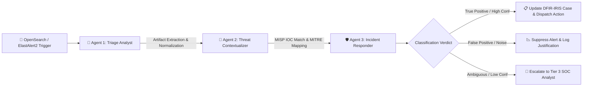

# Autonomous AI SOC Triage Engine & Multi-Agent Architecture

Author: Sandeep Mothukuri ([@sandeepmothukuri](https://github.com/sandeepmothukuri))  
Platform: Enterprise Detection Engineering & SOC Operations Lab v2

---

## 1. Multi-Agent Autonomous Triage Pipeline

The AI SOC tier deploys a 3-agent autonomous investigation system orchestrated by **CrewAI** and powered by local on-premise LLMs (Ollama Llama-3 / Mistral) ensuring zero external data leakage:

---

## 2. Agent Roles & Specializations

### 1. Alert Triage Analyst (`Agent 1`)
- **Mission**: Ingest raw JSON alert payload, parse CommandLine, process relationships, host context, and user privileges.
- **Key Output**: Normalized attack context summary and suspiciousness score (0–100).

### 2. Threat Intel & Contextualizer (`Agent 2`)
- **Mission**: Query MISP for threat actor overlap, query Zeek for related network connections, and verify LOLBAS binary usage.
- **Key Output**: MITRE technique correlation and threat attribution tags.

### 3. Incident Response Strategist (`Agent 3`)
- **Mission**: Synthesize findings into an actionable incident narrative, assign confidence metric (0.00–1.00), and recommend containment steps (e.g. host isolation via Velociraptor, firewall IP block via StackStorm).
- **Key Output**: Final triage decision, DFIR-IRIS case payload, and human-in-the-loop review flag.

---

## 3. Human-in-the-Loop Safeguards
- Any action with confidence $< 0.85$ requires mandatory human review.
- Automated host isolation triggers a non-blocking confirmation dialog in the SOC Command Center interface.
