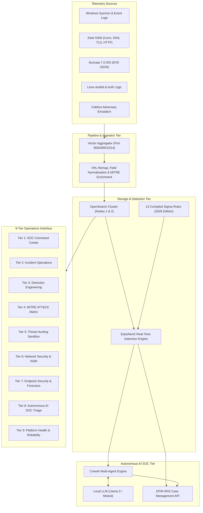

# SOC Platform Dashboard Architecture

Author: Sandeep Mothukuri ([@sandeepmothukuri](https://github.com/sandeepmothukuri))  
Platform: Enterprise Detection Engineering & SOC Operations Lab v2

---

## 1. Architectural Overview

The **Enterprise SOC Operations Platform** implements a high-throughput, low-latency telemetry ingestion and detection engineering pipeline. The visualization tier provides a single pane of glass spanning executive visibility, deep analyst investigation, purple team validation, and autonomous AI triage.

---

## 2. 9-Tier Operational Hierarchy

1. **SOC Command Center (`01_soc_command_center.html`)**:
   - Executive telemetry metrics: Total Ingested Events (EPS), Active Incidents Queue, Severity Distribution, Top Target Assets.
2. **Incident Operations (`02_incident_operations.html`)**:
   - Live alert triage stream, DFIR-IRIS case status tracking, chronological kill chain reconstruction.
3. **Detection Engineering (`03_detection_engineering.html`)**:
   - Sigma rule catalog (13 rules), test harness CI/CD validation results, detection coverage across MITRE tactics.
4. **MITRE ATT&CK Matrix (`04_mitre_attack.html`)**:
   - Enterprise ATT&CK matrix heatmap, technique frequency breakdown, adversary emulation test mappings.
5. **Threat Hunting (`05_threat_hunting.html`)**:
   - Advanced outlier analysis, Velociraptor VQL artifact inspection, rare process execution anomalies, MISP IOC pivoting.
6. **Network Security (`06_network_security.html`)**:
   - Zeek connection logs, Suricata IDS alert signatures, DNS tunneling detection, TLS certificate analysis.
7. **Endpoint Security (`07_endpoint_security.html`)**:
   - Windows Sysmon process trees (Event 1), LSASS memory access (Event 10), Remote Thread injection (Event 8), Linux Auditd privilege escalations.
8. **AI SOC (`08_ai_soc.html`)**:
   - CrewAI autonomous multi-agent triage logs, verdict confidence scores, false positive suppression, analyst escalation queue.
9. **Platform Health (`09_platform_health.html`)**:
   - Microservice health for all 12 Docker containers, Vector ingestion EPS, OpenSearch index sizing, queue latency.
